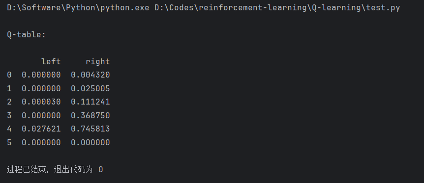

# reinforcement-learning
learning project for reinforcement learning

1. this repo keeps codes learnt from morvan's RL course
2. 

# 1. Q-learning
1. terminal's "reaching the flag" demo
2. how-to: run main function in `Q-learning/test.py`
3. result running in pycharm be like:

# 2. DQN

# 3.SAC