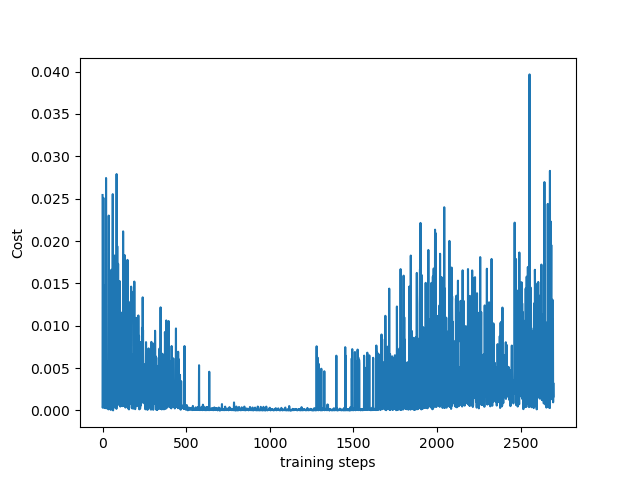

# reinforcement-learning
learning project for reinforcement learning

1. this repo keeps codes learnt from morvan's RL course
2. environment to run this repo:
   3. AMD Rayzen7


# 1. Q-learning
1. terminal's "reaching the flag" demo
2. how-to: run main function in `Q-learning/test.py`
3. result running in pycharm be like:


# 2. DQN(Deep Q Network)
1. 直接通过神经网络输出深度神经网络所学习到每个动作的值
   - 每个动作正确的Q值：用Q-learning中的Q-现实来代替
   - Q估计：用于神经网络的更新
   - 神经网络的更新：old参数 + α*()
2. Experience Replay
3. Fixed Q-targets
   - 预测Q估计的网络和预测
4. bug-list
   - down-grade version of python to 3.6, tensorflow 1.4, through anaconda, doing this:
   ```shell
   conda create --name py36 python=3.6 anaconda
   conda activate py36
   pip install tensorflow==1.4.0
   ```
   - "PY\36\tensorflow\core\platform\cpu_feature_guard.cc:137] Your CPU supports instructions that this TensorFlow binary was not compiled to use: AVX AVX2"
     - 是因为你的CPU支持AVX和AVX2指令集，但你安装的TensorFlow版本不支持这些指令集
     - 
5. and the learning figure output shall be like this:


# 3.SAC